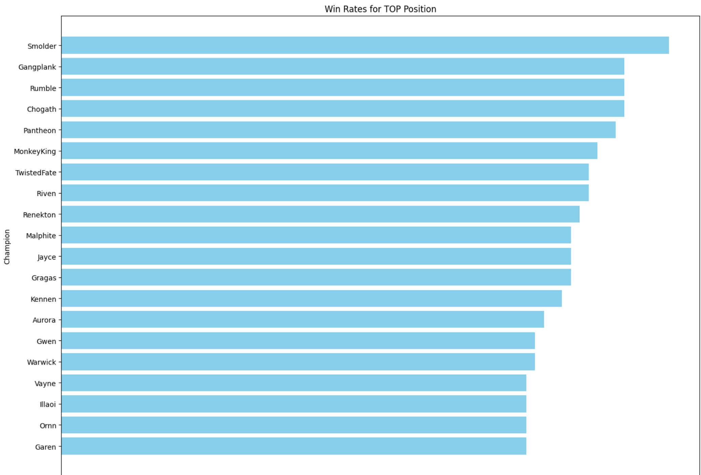

# Data Analysis on League of Legends for Champion Selection

**Author**: Zixiao Wang  
**Contact**: zw4258@nyu.edu

---

## Introduction

League of Legends, developed by Riot Games, is a globally popular multiplayer online battle arena game. Players compete in teams of five, each controlling a unique champion with distinct abilities, aiming to destroy the enemy's Nexus. The game map includes three lanes and four jungle areas, forming five positions for each team: Top, Jungle, Middle, Bottom, and Support/Utility.

*Figure 1: Champion Selection Page of League of Legends*

This project focuses on designing and developing a data processing structure to create a scalable recommendation system to optimize champion selection, utilizing Spark, Pandas, Matlab, the Spark.ML library, and RiotWatcher. The analysis demonstrates positive outcomes, indicating strong potential in this domain.

*Figure 2: Game map with indicated positions*

---

## Related Work

In an article by Kenneth Mann, the author discusses analyzing League of Legends match data using the Riot API with Python, pandas for data manipulation, and Matplotlib for data visualization. Another article by Brendon Kirouac presents a method for creating a match data database using Python and PostgreSQL, focusing on collecting match data via the Riot API and data cleaning.

---

## Data Collection Pipeline

The official server provides extensive match data updated in real-time. Match data can be collected by sending requests to the League of Legends server with an API key, although there are request limits. For continuous data collection, multiple API keys are recommended.

This project targets data from the Diamond division, aiming to collect match data by scraping high-division player data. Data collected includes:
- **summID**: Contains player IDs from the Diamond division.
- **PUUIDs**: Special IDs for each player.
- **matchID**: IDs for each match.
- **championData**: Champion selection, bans, and game duration for the winning team.
- **champion_withLost_Data**: Contains data on champion selection for the losing team.

---

## Data Cleaning

The dataset is cleaned to remove redundant information and retain relevant data, such as Champion selection, items bought, and banned champions. Data is stored in five CSV files, and the cleaning structure ensures that the data can be tailored to suit different project goals.

---

## Data Analysis

### Win Rate for Different Positions

*Figure 3: Win counts for the top 20 champions in the Top position*

Win rate is a key metric to evaluate champion effectiveness for a given position. Data analysis reveals that certain champions tend to win more in specific positions.

*Figure 4: Win rate for top champions in different positions*

### Time Duration as Winning Team

Most games end around the 30-minute mark, highlighting the significance of mid-game strategies. This analysis also identifies compositions effective in late-game scenarios.

*Figure 5: Game duration and winning team compositions at various stages*

---

## Model Analysis and Potential Improvement

This project uses Apache Spark's MLlib to build models analyzing team composition, game duration, and win rate predictions.

### Team Composition and Game Duration Model

A RandomForestRegressor is used to predict game duration based on team composition. While the model's initial Root Mean Squared Error (RMSE) is 14.739, further data collection and enhanced server capacity could improve accuracy.

### Top Lane Win Rate Prediction Model

A separate model predicts win rates in the Top lane with an RMSE of 7.7652, demonstrating that more focused data yields better results.

---

## Potential User Case

A typical user could select their position, view high-win-rate champions, ban specific champions for advantage, and use the model to determine team viability across early, mid, and late game stages.

*Figure 6: Top 2 most banned champions when selecting Smolder*

---

## Conclusion

This project provides a robust data infrastructure and pipeline to assist League of Legends players in optimizing champion selection. It uniquely combines data analysis with predictive modeling to offer actionable insights, paving the way for improved strategies and gameplay.

---

## References

1. RiotWatcher Library :https://riot-watcher.readthedocs.io/en/latest/riotwatcher/LeagueOfLegends/index.html
2. Apache Spark MLlib: https://spark.apache.org/docs/latest/api/python/reference/api/pyspark.ml.regression.RandomForestRegressor.html
3. Riot Games API Documentation  : https://developer.riotgames.com/apis/
4. Articles by Kenneth Mann and Brendon Kirouac on League of Legends data analysis.: https://medium.com/@brendonkirouac/feature-engineering-for-a-league-of-legends-item-recommender-in-python-49b3079a1903 and https://medium.com/@mannkenn/league-of-legends-data-science-project-42bd0933ddb4

